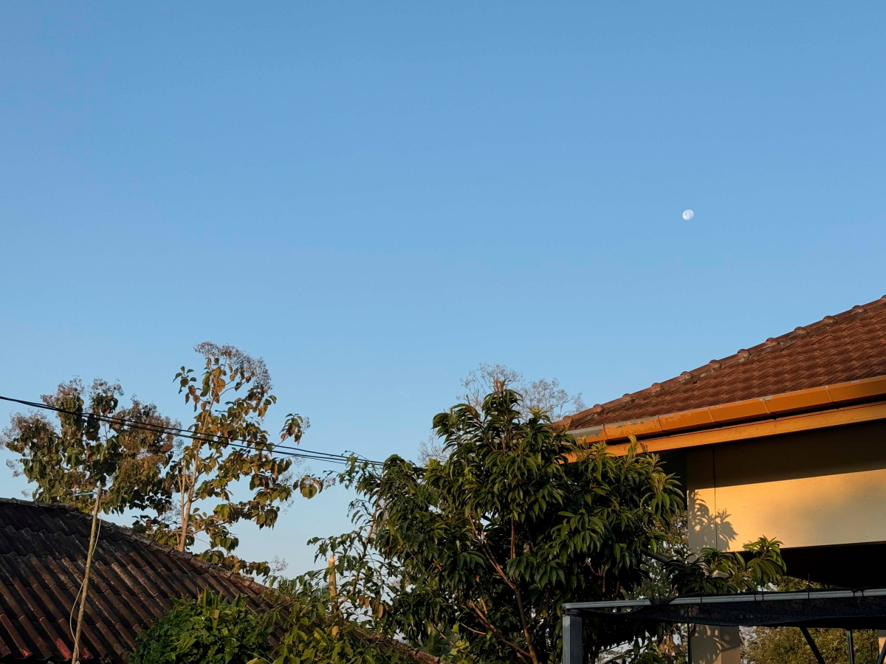
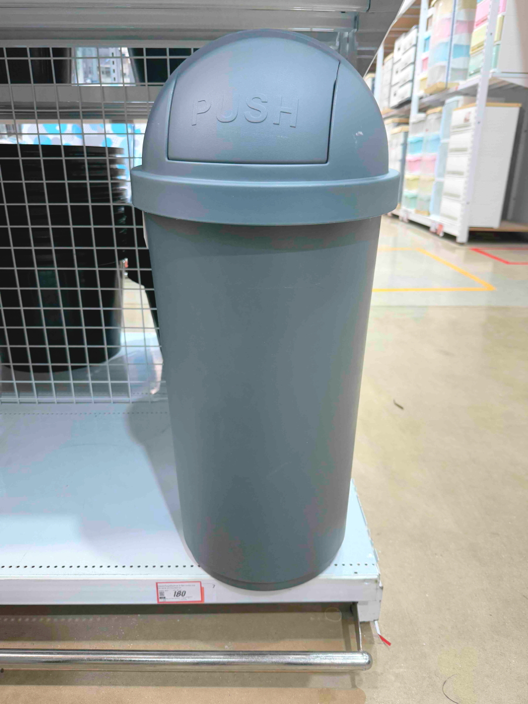
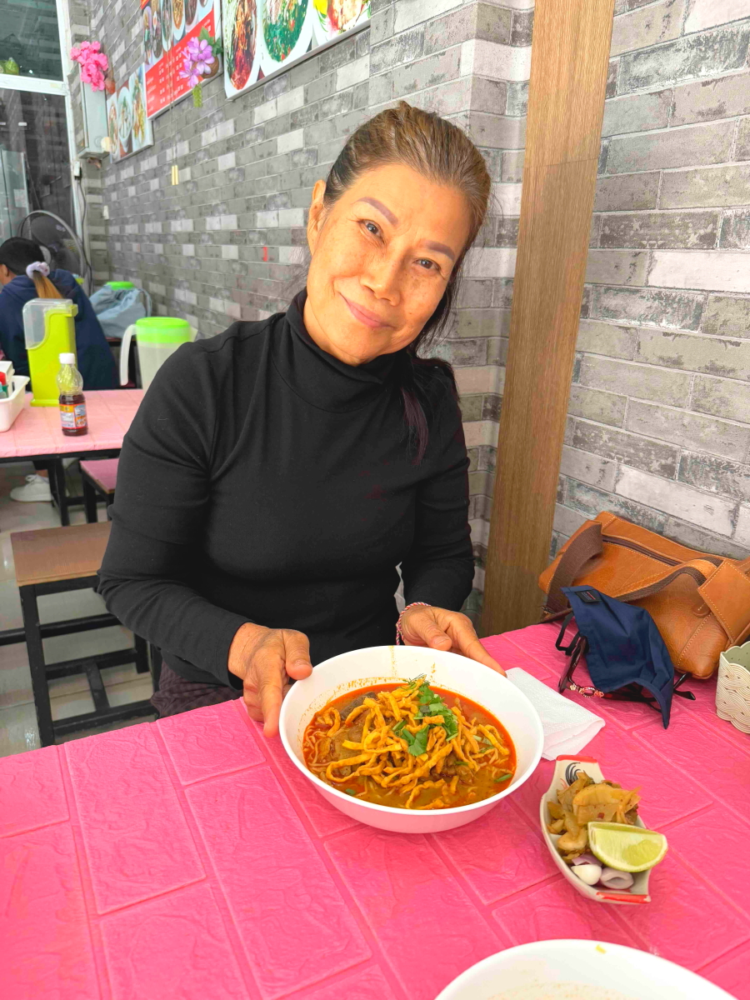

# 20250117_chiangrai

<html>
<head>

<meta charset="UTF-8">
<meta http-equiv="Content-Type" content="text/html; charset=UTF-8">
<meta http-equiv="X-UA-Compatible" content="IE=EmulateIE10" />
<meta http-equiv="X-UA-Compatible" content="IE=edge">

<!--ここから上はお決まりの定型文です-->

<!--ここからが表現の書式などを決めるcssという部分-->

<link href="https://cdnjs.cloudflare.com/ajax/libs/lightbox2/2.7.1/css/lightbox.css" rel="stylesheet">

</head>

<body>

モバイル端末をお使いの場合は、画面を横向きにすると
より見やすくご覧頂けます。

<!--ここ上は、ほぼそのまま使います！-->

<!--QRコードの挿入例-->

 アクセス用QRコード

<marquee direction="left" scrollamount="20" width="30%">(^_^)/~alis</marquee>

<!--流れ文字の挿入例-->
<h1><marquee behavior="left">!!! 2025/01/17、朝のお月様から夜にかけての満天の星まで!!!</marquee></h1>

                          

<!--ここから下が、本体部分-->

<h2>朝日が登り始めると、西の空にお月様が沈んでゆきました</h2>

<h2>チェンライの北隣にある小さな町、メーサイで銀行に寄ります</h2>

<h2>銀行の向かいは携帯ショップ、IT機器のお店はおしゃれです</h2>

<h2>金曜日の夕方は町の通りを閉鎖して市場になります 気の早い出店者はお昼過ぎから開店中</h2>

<h2>お昼ご飯でお世話になった親戚がホームセンターでお買い物</h2>

<h2>便器コーナーでフタを探します</h2>

<h2>フタのサイズを測ってこなかったので、購入は断念</h2>

<h2>タイで主流の毛先の柔らかい斜めになったほうき</h2>

<h2>屋内用ゴミ箱</h2>

<h2>カートに積んでお会計</h2>

<h2>さっきの市場とホームセンターで購入した品々</h2>

<h2>お昼のピーク時間を過ぎたのでメーサイの町に戻って評判のラーメン屋さん</h2>

<h2>3日連続でお昼をいただいたので、今日はこちらからラーメンをご馳走します</h2>

<h2>メニューはシンプル</h2>

<h2>お気に入りはこちら</h2>

<h2>水はセルフサービス</h2>

<h2>お客さんは3世代の一家と、先生に引率された高校生</h2>

<h2>食後はまたまた市場で野菜調達</h2>

<h2>その後は低価格雑貨屋さんでお買い物</h2>

<h2>タイの蚊は日本の蚊取り線香では死なないので現地購入は必須</h2>

<h2>選挙が近いらしく、道路脇にはポスターが立ちました 写真の右側はタクシン氏の娘さん</h2>

<h2>YouTube再生とHP作成マシンと化したMacBook Proとセブンイレブンのコーヒー</h2>

<h2>木陰でくつろぐネコ</h2>

<h2>庭のお花たち</h2>

<h2>熱帯のミツバチ、スマホかざしても逃げません。それだけ蜜が美味しいのかも？ i-Phoneの接写モードです</h2>

<h2>水を張った鉢に咲いたハスのお花</h2>

<h2>陽が傾くと猫ちゃんは塀の上で監視モード</h2>

<h2>いつものスーパーで安くなった鳥の丸焼きを購入 夕方7時過ぎには110バーツに値下げしてました</h2>

<h2>棚には賞味期限が新しくなったパンが並びます</h2>

<h2>朝のパンはこれで2日分</h2>

<h2>飲み物はこの辺りから選びます</h2>

<h2>スーパーでも、金のお店は派手でした 黒マスクはセキュリティーのお姉さん</h2>

<h2>ワゴンセールのサンダルは300円切ってます</h2>

<h2>夕焼けグラデーションはピンク味を帯びてました 宵の明星「金星」もキラリ！</h2>

<h2>夜空は惑星２つが加わって賑やかです</h2>

<h2>日本では地平線スレスレで見えにくい「カノープス」も木の上まで上がります 中国のことわざで、これを見ると長生きできるとされる「南極老人星」</h2>

   
<h2>以上、朝一の東の空に沈みゆく月から夜の賑やかな星空でした 日中は取り留めのない画像ばかりでしたが、 ここまで観ていただきありがとうございました。</h2>

     
<h2>
<a href="https://torokoid.github.io/20241126_chiangrai/" target="_blank">Back to the menu page</a>
</h2>

   

         

  

      

<!--本体はここまで-->

<!--画面に空白地帯を作って、背景が見えるようにしています-->
                                              

<!-- フッタ -->
<footer>

Copyright 2025/01/18 alis @ChiangRai

</footer>

<!--HPにさまざまなJavaScriptを呼び込むための書式-->

